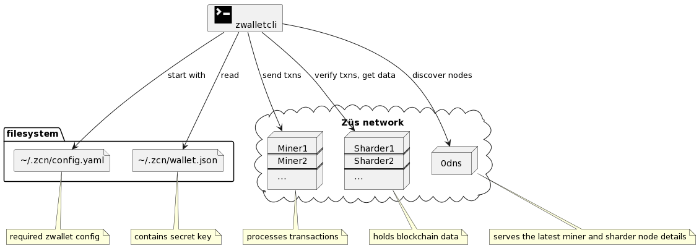

# zwallet - a CLI for Züs wallet 

ZWallet CLI is a command-line command line interface (CLI) to demonstrate the wallet functionalities of Züs. It provides an interactive way to receive, send, store, stake, and exchange ZCN tokens, as well as fetch information about Züs components such as miners, sharders, and blobbers.

The CLI utilizes the [Züs GoSDK](https://github.com/0chain/gosdk).
- [Züs Overview](#züs-overview)
- [zwallet - a CLI for Züs wallet](#zwallet---a-cli-for-züs-wallet)
  - [Architecture](#architecture)
  - [Getting started](#getting-started)
    - [1. Installation](#1-installation)
    - [2. Run `zwallet` commands](#2-run-zwallet-commands)
  - [Global parameters](#global-parameters)
  - [Commands](#commands)
    - [Creating and restoring wallets](#creating-and-restoring-wallets)
      - [Creating wallet - (any command)](#creating-wallet---any-command)
      - [Recovering wallet - `recoverwallet`](#recovering-wallet---recoverwallet)
    - [Exploring network nodes](#exploring-network-nodes)
      - [Listing all miners - `ls-miners`](#listing-all-miners---ls-miners)
      - [Listing all sharders -`ls-sharders`](#listing-all-sharders--ls-sharders)
      - [Listing all blobbers - `getblobbers`](#listing-all-blobbers---getblobbers)
      - [Listing all authorizers - `bridge-list-auth`](#list-authorizers)
      - [Getting Auhorizer Configuration - `bridge-auth-config`](#get-authorizer-configuration)
      - [Getting node ID by URL - `getid`](#getting-node-id-by-url---getid)
      - [Getting Storage Smart Contract Configuration - `sc-config`](#show-storage-smart-contract-configuration)
      - [Getting Global Configuration - `global-config`](#show-global-configurations)
      - [Get Version - `get-version`](#get-version)
    - [Getting and sending tokens](#getting-and-sending-tokens)
      - [Getting tokens with Faucet smart contract - `faucet`](#getting-tokens-with-faucet-smart-contract---faucet)
      - [Checking balance - `getbalance`](#checking-balance---getbalance)
      - [Sending tokens to another wallet - `send`](#sending-tokens-to-another-wallet---send)
      - [Verifying a transaction - `verify`](#verifying-a-transaction---verify)
      - [Collect rewards - `collect-reward`](#collect-rewards)  
    - [Staking on miners and sharders](#staking-on-miners-and-sharders)
      - [Getting the staking config - `mn-config`](#getting-the-staking-config---mn-config)
      - [Getting a miner or sharder info for staking - `mn-info`](#getting-a-miner-or-sharder-info-for-staking---mn-info)
      - [Locking a stake on a node - `mn-lock`](#locking-a-stake-on-a-node---mn-lock)
    - [Getting the stake pools of a wallet - `mn-user-info`](#getting-the-stake-pools-of-a-wallet---mn-user-info)
      - [Getting the stake pool info - `mn-pool-info`](#getting-the-stake-pool-info---mn-pool-info)
      - [Unlock a stake - `mn-unlock`](#unlock-a-stake---mn-unlock)
      - [Updating staking config of a node - `mn-update-settings`](#updating-staking-config-of-a-node---mn-update-settings)
  - [Config](#config)
    - [~/.zcn/config.yaml](#zcnconfigyaml)
    - [(Optional) Override Network](#override-network)

## Züs Overview 

[Züs](https://zus.network/) is a high-performance cloud on a fast blockchain offering privacy and configurable uptime. It is an alternative to traditional cloud S3 and has shown better performance on a test network due to its parallel data architecture. The technology uses erasure code to distribute the data between data and parity servers. Züs storage is configurable to provide flexibility for IT managers to design for desired security and uptime, can design a hybrid or a multi-cloud architecture with a few clicks using [Blimp's](https://blimp.software/) workflow, and can change redundancy and providers on the fly.

For instance, the user can start with 10 data and 5 parity providers and select where they are located globally, and later decide to add a provider on-the-fly to increase resilience, and performance or switch to a lower-cost provider.

Users can also add their own servers to the network to operate in a hybrid cloud architecture. Such flexibility allows users to improve their regulatory obligations, content distribution, and security requirements with an authentic multi-cloud architecture. Users can also construct a private cloud with all their own servers rented across the globe to have better content distribution, a highly available network, higher performance, and lower cost.

[The QoS protocol](https://medium.com/0chain/qos-protocol-weekly-debrief-april-12-2023-44524924381f) is time-based where the blockchain challenges a provider on a file that the provider must respond within a certain time based on its size to pass. This forces the provider to have a good server and data center performance to earn rewards and income.

The [privacy protocol](https://zus.network/build) from Züs is unique where a user can easily share their encrypted data with their business partners, friends, and family through a proxy key sharing protocol, where the key is given to the providers, and they re-encrypt the data using the proxy key so that only the recipient can decrypt it with their private key.

Züs has ecosystem apps to encourage traditional storage consumption, such as [Blimp](https://blimp.software/), a S3 server and cloud migration platform, and [Vult](https://vult.network/), a personal cloud app to store encrypted data and share privately with friends and family, and [Chalk](https://chalk.software/), a high-performance story-telling storage solution for NFT artists.

Other apps are [Bolt](https://bolt.holdings/), a wallet that is very secure with air-gapped 2FA split-key protocol to prevent hacks from compromising your digital assets, and it enables you to stake and earn from the storage providers; [Atlus](https://atlus.cloud/), a blockchain explorer and [Chimney](https://demo.chimney.software/), which allows anyone to join the network and earn using their server or by just renting one, with no prior knowledge required.

## Architecture

Users can configure `zwallet` to work with any Züs network. It uses a config and a wallet file stored on the local filesystem.

For most transactions, `zwallet` uses the `0dns` to discover the network nodes, then creates and submits transaction(s) to the miners, and finally waits for transaction confirmation on the sharders.



## Getting started

### 1. Installation

**Prerequisites**
Install Go, an open-source programming language based on your operating system from the links below.
- Go: Mac, Linux, and Windows installation instructions can be found [here](https://go.dev/doc/install).

**Procedures**

1. Clone the `zwalletcli` repo and install

```sh
git clone https://github.com/0chain/zwalletcli.git
cd zwalletcli
make install
```

2. Add config yaml at `~/.zcn/config.yaml`

The following script sets `https://demo.zus.network` as your network.

```sh
cat > ~/.zcn/config.yaml << EOF
block_worker: https://demo.zus.network/dns
signature_scheme: bls0chain
min_submit: 50 # in percentage
min_confirmation: 50 # in percentage
confirmation_chain_length: 3
EOF
```
3. Run `zwallet` to display the list of supported commands.

```sh
./zwallet
```
----
For detailed steps on the installation, follow the guides below:

- [How to build on Linux/Mac](https://github.com/0chain/zwalletcli/wiki/Build-on-Linux-and-Mac)
- [How to build on Windows](https://github.com/0chain/zwalletcli/wiki/Build-Windows)

### 2. Run `zwallet` commands
Ensure your terminal's working directory is inside the `zwalletcli` repo for the following steps.
... MINGW64 ~/zwalletcli
## Global parameters

`zwallet` accepts global parameters to override default configuration and can be used in any command.

| Parameter     | Description                     | Default        |
| ------------- | ------------------------------- | -------------- |
| `--h, --help` | Shows help/parameters for a particular command (./zwallet -h) will list all help commands. To know detail about a particular command like example 'send', use (./zwallet send --help )                     |                |
| `--config`    |  [Config file](https://github.com/0chain/zwalletcli/blob/staging/network/config.yaml) and [description](https://github.com/0chain/zwalletcli#zcnconfigyaml). Configuration file    | `config.yaml`  |
| `--configDir` | Configuration directory                | `~/.zcn`       |
| `--network`   | Network file to overwrite the network details [Network file](#override-network) | `network.yaml` |
| `--silent`    | Do not print detailed logs    | `false`        |
| `--wallet`    | Wallet file                     | `wallet.json`  |
| `--withNonce` | Nonce that will be used in transaction    | `0`  |
| `--fee`       | Transaction Fee for given transaction     | if not set, default is blockchain min fee)  |

## Commands

### Creating and restoring wallets

#### Creating wallet - (any command)
You can create a wallet in two ways.
1) Use the `create-wallet` or
2) Use the 'faucet' command
##### Creating a wallet if none exists

Run the `create-wallet` command to create a wallet if none exists.


Here is a sample with `create-wallet` command and this creates a wallet at the default location`~/.zcn/wallet.json`

```sh
./zwallet create-wallet
```
Sample Output 

```
wallet saved in /home/.../.zcn/wallet.json
{"client_id":"xxxxxxxxxxxxxxxxxxxxxxxxxxxxx",
"client_key":"xxxxxxxxxxxxxxxxxxxxxxxxxxxxxxxxx",
"keys":[{"public_key":"xxxxxxxxxxxxxxxxxxxxxxxxxxxxxxxxxxxxxxxxxx",
"private_key":"xxxxxxxxxxxxxxxxxxxxxxxxxxxxxxxxxxxxxx"}],
"mnemonics":"xxxx xxxx xxxx xxxxx",
"version":"1.0","date_created":"2023-05-03T12:44:46+05:30","nonce":0}

```
If there is an existing wallet in the .zcn directory, and you run `./zwallet create-wallet`, you will get a message - 
```
..wallet already exists at \..\.zcn\wallet.json
```
#### Creating wallet with 'faucet' command
Here is a sample `faucet` command, and this creates a wallet at default location`~/.zcn/wallet.json`

```sh
./zwallet faucet --methodName pour --input "new wallet"
```
Verify wallet creation
You can verify the wallet creation by checking your .zcn folder for the corresponding wallet name.

#### Creating additional wallet with 'faucet' command
You can create more wallets with the faucet command with a wallet name of your choice. The `faucet` command to create a second wallet at the location `~/.zcn/` is as follows.

```sh
./zwallet faucet --methodName pour --input "new wallet" --wallet my_fifth_wallet.json
```

Sample Output (Windows)
```
******* Wallet SDK Version:v1.8.17-78-g80b63345 ******* (InitZCNSDK)
No wallet in path  C:\Users\..\.zcn\my_fifth_wallet.json found. Creating wallet...
ZCN wallet created!!.. Execute faucet smart contract success with txn:  xxxxxxxxxxxxxxxxxxxxxxxxxxxxxxxxxxxxx
```
Verify wallet creation
You can verify the recovered wallet by checking your .zcn folder for the corresponding wallet name.

#### Recovering wallet - `recoverwallet`

`recoverwallet` is used when restoring a lost wallet or when loading the wallet from a different computer.

Given a wallet's mnemonics, you can recover and recreate your wallet.

| Parameter    | Required | Description                            | Default | Valid Values |
| ------------ | -------- | -------------------------------------- | ------- | ------------ |
| `--mnemonic` | Yes      | The mnemonics of the wallet to recover |         |              |
| `--offline`  | No       | recover wallet without registration on blockchain|  false  |              |


Sample command

```sh
./zwallet recoverwallet --wallet recovered_wallet.json --mnemonic "pull floor crop best weasel suit solid gown filter kitten loan absent noodle nation potato planet demise online ten affair rich panel rent sell"
```

Sample output

```
Wallet recovered!!
```
Verify recovered wallet
You can verify the recovered wallet by checking your .zcn folder for the corresponding wallet name.

### Exploring network nodes

#### Listing all miners - `ls-miners`

The list of miners are retrieved using the Miner smart contract.

| Parameter | Required | Description          | Default | Valid Values      |
| --------- | -------- | -------------------- | ------- | ----------------- |
| `--json`  | No       | Print output as JSON |         | <empty to enable> |


View the list of miners with the following command.
```sh
./zwallet ls-miners
```

Sample output

```
- ID:         cdb9b5a29cb5f48b350481694c4645c2db24500e3af210e22e2d10477a68bad2
- Host:       demo1.zus.network
- Port:       31203
- ID:         3d9a10dac6fb3903d4a5283a42ae07b29d8e5d228afcce9bfc14e3e9dbc82748
- Host:       demo2.zus.network
- Port:       31201
- ID:         aaa721d5fbf4ca83e20c8c40874ebcb144b86f57173633ff1702968677c2fa98
- Host:       demo3.zus.network
- Port:       31202
```

You can use various flags to customize your usage.

| Command     | flag        |Description                      | Usage                         | Output  | 
| ---------   | --------    |------------------------------- |---------
| `ls-miners` | --active    |Gets list of active miners only              |`./zwallet ls-miners --active` |         | 
| `ls-miners` |  --all      |Includes all registered miners               |`./zwallet ls-miners --all`    |         | 
| `ls-miners` | --json      |as JSON                                      |`./zwallet ls-miners --active` |         | 
| `ls-miners` | --limit     |Limits the amount of miners returned (default 20)            |`./zwallet ls-miners --active` |         | 
| `ls-miners` | --offset    |Skips the number of miners mentioned            |`./zwallet ls-miners --active` |         |
 flag usage output


#### Listing all sharders -`ls-sharders`

The list of sharders are retrieved using the latest finalized magic block. All registered sharders can be retrieved with the `--all` parameter.

| Parameter | Required | Description                             | Default | Valid Values      |
| --------- | -------- | --------------------------------------- | ------- | ----------------- |
| `--json`  | No       | Print output as JSON                    |         | <empty to enable> |
| `--all`   | No       | Print also registered nodes on Miner SC |         | <empty to enable> |


List all sharders with the below command.
```sh
./zwallet ls-sharders --all
```

Sample output

```
MagicBlock Sharders
ID: 12e317e5d7a4a0a914ec26074e28f00502c735ddf7ac7d156b34e83e39792a9d
  - N2NHost: demo1.zus.network
  - Host: demo1.zus.network
  - Port: 31102
ID: 675502b613ba1c5985636e3e92b9a857855a52155e3316bb40fe9607e14167fb
  - N2NHost: demo2.zus.network
  - Host: demo1.zus.network
  - Port: 31101

Registered Sharders
ID: 675502b613ba1c5985636e3e92b9a857855a52155e3316bb40fe9607e14167fb
  - N2NHost: demo1.zus.network
  - Host: demo1.zus.network
  - Port: 31101
ID: 12e317e5d7a4a0a914ec26074e28f00502c735ddf7ac7d156b34e83e39792a9d
  - N2NHost: demo2.zus.network
  - Host: demo2.zus.network
  - Port: 31102
ID: 43f4f011698db6f2078e6ceb1cd981ab3bd35d07b7ac6fdf7c77aec1feee09be
  - N2NHost: demo3.zus.network
  - Host: demo3.zus.network
  - Port: 31101
ID: fd02f4436692bd9f679fae809f4f140fd4daaa35769ae9c6db1ab9664f766c22
  - N2NHost: 144.76.91.241
  - Host: demo4.zus.network
  - Port: 31102

```

#### Listing all blobbers - `getblobbers`

The list of blobbers are retrieved using the Storage smart contract.


List all blobbers with the below command.
```sh
./zwallet getblobbers
```

Sample output

```
Blobbers:
                 URL                 |                                ID                                |          CAP           |     R / W PRICE     | DEMAND
+------------------------------------+------------------------------------------------------------------+------------------------+---------------------+--------+
  http://demo1.zus.network:31305 | 011a5444c9fe53137da7c3d871f3bf4bbf3c01607b14aa95ff2de43b5537d4b6 | 271.5 GiB / 1000.0 GiB | 0.010000 / 0.010000 |    0.1
  http://demo1.zus.network:31306 | 2efc85d6a2f36380e1e77b843cd9f4fe55668271cae4925ab38a92504176e5df | 107.8 GiB / 1000.0 GiB | 0.010000 / 0.010000 |    0.1
  http://demo1.zus.network:31302 | 34934babf0781c21736023ff89bc554928d77c028a968ef7344a460611d5a8d2 | 104.3 GiB / 1000.0 GiB | 0.010000 / 0.010000 |    0.1
```
#### List Authorizers

`./zwallet bridge-list-auth ` command can be used to list all authorizers available to validate client transactions.

**Sample Command to list authorizers:**

```
./zwallet bridge-list-auth
```

**Sample Response:**

```
[
  {
   "id": "2f945f7310689f17afd8c8cb291e1e3ba21677243aa1d404a2293064e7983d60",
   "url": "https://demo.zus.network/authorizer01/"
  },
  {
   "id": "7b07c0489e2f35d7c13160f4da2866b4aa69aa4e8d2b2cd9c4fc002693dca5d7",
   "url": "https://demo.zus.network/authorizer02/"
  },
  {
    "id": "896c171639937a647f9e91d5ba676be580f6d2b7e0d708e4fe6ea36610a13ffd",
    "url": "https://demo.zus.network/authorizer03/"
  }
]
```

#### Get Authorizer Configuration
`./zwallet bridge-auth-config `command can be used to view the authorizer configuration. Here are the parameters for the command.

| Parameter | Required | Description                                       |
| --------- | -------- | ------------------------------------------------- |
| --id      | Yes      | Provide Authorizer ID to view its configuration. |
| --help    |          | Syntax Help for the command                       |

Sample command to list details of an Authorizer's configuration.:

```
./zwallet bridge-auth-config --id $AUTHORIZER_ID
```

Sample Response:

```
{
  "id": "2f945f7310689f17afd8c8cb291e1e3ba21677243aa1d404a2293064e7983d60",
  "url": "https://demo.zus.network/authorizer01/",
  "fee": 0,
  "latitude": 0,
  "longitude": 0,
  "last_health_check": 0,
  "delegate_wallet": "",
  "min_stake": 0,
  "max_stake": 0,
  "num_delegates": 0,
  "service_charge": 0
}
```
#### Getting node ID by URL - `getid`

Print the ID of a blockchain node.

| Parameter | Required | Description                               | Default | Valid Values |
| --------- | -------- | ----------------------------------------- | ------- | ------------ |
| `--url`   | Yes      | URL to the node (miner, sharder, blobber) |         |              |


Command to get the ID of a blockchain node.
```sh
./zwallet getid --url http://demo1.zus.network:31101
```

Output

```
URL: http://demo1.zus.network:31101
ID: 675502b613ba1c5985636e3e92b9a857855a52155e3316bb40fe9607e14167fb
```

#### Show Storage Smart Contract Configuration

`./zwallet sc-config ` command displays the current storage smart contract configuration.  

Sample command to display storage smart contract configuration: 
```
./zwallet sc-config
```
Sample Response :
```
.blobber_slash    0.1
block_reward.block_reward        1.8
block_reward.gamma.a     10
block_reward.gamma.alpha         0.2
block_reward.gamma.b     9
block_reward.qualifying_stake    1
block_reward.zeta.i      1
block_reward.zeta.k      0.9
block_reward.zeta.mu     0.2
cancellation_charge      0.2
challenge_enabled        true
cost.add_blobber         100
cost.add_free_storage_assigner   100
cost.add_validator       100
cost.blobber_health_check        100
cost.cancel_allocation   8400
cost.challenge_request   100
cost.challenge_response          1600
cost.collect_reward      100
cost.commit_connection   100
cost.commit_settings_changes     0
cost.finalize_allocation         9500
cost.free_allocation_request     1500
cost.free_update_allocation      2500
cost.generate_challenge          100
cost.kill_blobber        100
cost.kill_validator      100
cost.new_allocation_request      3000
cost.new_read_pool       100
cost.pay_blobber_block_rewards   100
cost.read_pool_lock      100
cost.read_pool_unlock    100
cost.read_redeem         100
cost.shutdown_blobber    100
cost.shutdown_validator          100
cost.stake_pool_lock     100
cost.stake_pool_pay_interests    100
cost.stake_pool_unlock   100
cost.update_allocation_request   2500
cost.update_blobber_settings     100
cost.update_settings     100
cost.update_validator_settings   100
cost.write_pool_lock     100
cost.write_pool_unlock   100
free_allocation_settings.data_shards     4
free_allocation_settings.parity_shards   2
free_allocation_settings.read_pool_fraction      0
free_allocation_settings.read_price_range.max    0
free_allocation_settings.read_price_range.min    0
free_allocation_settings.size    2000000000
free_allocation_settings.write_price_range.max   1
free_allocation_settings.write_price_range.min   0
health_check_period      1h0m0s
max_blobbers_per_allocation      40
max_challenge_completion_time    3m0s
max_delegates    200
max_individual_free_allocation   1e+06
max_mint         7.5e+07
max_read_price   100
max_stake        20000
max_total_free_allocation        9.223372036854776e+08
max_write_price          100
min_alloc_size   1048576
min_blobber_capacity     10737418240
min_stake        0.01
min_write_price          0.001
owner_id         1746b06bb09f55ee01b33b5e2e055d6cc7a900cb57c0a3a5eaabb8a0e7745802
readpool.min_lock        0
stakepool.kill_slash     0.5
stakepool.min_lock_period        0s
time_unit        720h0m0s
validator_reward         0.025
validators_per_challenge         2
writepool.min_lock       0.1
```

#### Get Version 
The version of zwallet and gosdk can be fetched using the `./zwallet version` command.

Sample Command :
```
./zwallet version
```
Sample Response :
```
Version info:
        zwallet...:  v1.2.3-21-gb10c459
        gosdk.....:  v1.8.17-0.20230522160233-570f983a6283
```
#### Show global configurations 
`./zwallet global-config ` command displays the global chain configuration 

Sample Command :
```
./zwallet global-config
```
Sample Response :
```
server_chain.async_blocks_fetching.max_simultaneous_from_miners          100
server_chain.async_blocks_fetching.max_simultaneous_from_sharders        30
server_chain.block.consensus.threshold_by_count          66
server_chain.block.consensus.threshold_by_stake          0
server_chain.block.generation.retry_wait_time    5
server_chain.block.generation.timeout    15
server_chain.block.generators_percent    0.2
server_chain.block.max_block_cost        10000
server_chain.block.max_block_size
server_chain.block.max_byte_size         1638400
server_chain.block.min_block_size        1
server_chain.block.min_generators        2
server_chain.block.proposal.max_wait_time        180ms
server_chain.block.proposal.wait_mode    static
server_chain.block.replicators   0
server_chain.block.reuse_txns    false
server_chain.block.sharding.min_active_replicators       25
server_chain.block.sharding.min_active_sharders          25
server_chain.block.validation.batch_size         1000
server_chain.block_rewards       true
server_chain.client.discover     true
server_chain.client.signature_scheme     bls0chain
server_chain.dbs.settings.aggregate_period       10
server_chain.dbs.settings.debug          false
server_chain.dbs.settings.page_limit     50
server_chain.dbs.settings.partition_change_period        100000
server_chain.dbs.settings.partition_keep_count   20
server_chain.dkg         true
server_chain.health_check.deep_scan.batch_size   50
server_chain.health_check.deep_scan.enabled      false
server_chain.health_check.deep_scan.repeat_interval_mins         3m
server_chain.health_check.deep_scan.report_status_mins   1m
server_chain.health_check.deep_scan.settle_secs          30s
server_chain.health_check.deep_scan.window       0
server_chain.health_check.proximity_scan.batch_size      50
server_chain.health_check.proximity_scan.enabled         true
server_chain.health_check.proximity_scan.repeat_interval_mins    1m
server_chain.health_check.proximity_scan.report_status_mins      1m
server_chain.health_check.proximity_scan.settle_secs     30s
server_chain.health_check.proximity_scan.window          100000
server_chain.health_check.show_counters          true
server_chain.lfb_ticket.ahead    5
server_chain.lfb_ticket.rebroadcast_timeout      15s
server_chain.messages.verification_tickets_to    all_miners
server_chain.owner       edb90b850f2e7e7cbd0a1fa370fdcc5cd378ffbec95363a7bc0e5a98b8ba5759
server_chain.round_range         10000000
server_chain.round_timeouts.round_restart_mult   10
server_chain.round_timeouts.softto_min   1500
server_chain.round_timeouts.softto_mult          1
server_chain.round_timeouts.timeout_cap          1
server_chain.smart_contract.faucet       true
server_chain.smart_contract.miner        true
server_chain.smart_contract.multisig     false
server_chain.smart_contract.setting_update_period        200
server_chain.smart_contract.storage      true
server_chain.smart_contract.timeout      8000ms
server_chain.smart_contract.vesting      false
server_chain.smart_contract.zcn          true
server_chain.state.enabled       true
server_chain.state.prune_below_count     100
server_chain.state.sync.timeout          10
server_chain.stuck.check_interval        10
server_chain.stuck.time_threshold        60
server_chain.transaction.cost_fee_coeff          1000000
server_chain.transaction.exempt          contributeMpk,shareSignsOrShares,wait,mint,pour
server_chain.transaction.max_fee         0.01
server_chain.transaction.min_fee         0
server_chain.transaction.payload.max_size        98304
server_chain.transaction.timeout         600
server_chain.view_change         false
```

### Getting and sending tokens

#### Getting tokens with Faucet smart contract - `faucet`

Tokens can be retrieved and added to your wallet through the Faucet smart contract.

| Parameter      | Required | Description                                                  | Default | Valid Values     |
| -------------- | -------- | ------------------------------------------------------------ | ------- | ---------------- |
| `--methodName` | Yes      | Smart Contract method to call (`pour` - get tokens, `refill` - return tokens) |         | `pour`, `refill` |
| `--input`      | Yes      | Request description                                          |         | any string       |
| `--tokens`     | No       | Amount of tokens (maximum of 1.0)                            | 1.0     | (0 - 1.0]        |


The following command will give 1 token to the default wallet.

```sh
./zwallet faucet --methodName pour --input "need token"
```

You can specify the number of tokens required using the following command for adding 5 tokens with --tokens 5

```sh
./zwallet faucet --methodName pour --input "need token" --tokens 5
```

Sample output from `faucet` prints the transaction.

```
Execute faucet smart contract success with txn :  d25acd4a339f38a9ce4d1fa91b287302fab713ef4385522e16d18fd147b2ebaf
```

#### Checking balance - `getbalance`

Wallet balances are retrieved from sharders.

> Note: Balance would not show any [locked tokens](#locking-tokens-for-interest---lock).


```sh
./zwallet getbalance
```

Sample output

```
Balance: 3 (4.2299999999999995 USD)
```

To check the balance of another wallet, use `--wallet` global parameter.

```sh
./zwallet getbalance --wallet another_wallet.json
```

> Note: When there is no token on the wallet yet, output will show `Get balance failed.`

#### Sending tokens to another wallet - `send`


Transferring tokens from one wallet to another is done through `send`

| Parameter        | Required | Description                    | Default | Valid Values |
| ---------------- | -------- | ------------------------------ | ------- | ------------ |
| `--to_client_id` | Yes      | Client ID of the recipient     |         |              |
| `--tokens`       | Yes      | Amount of tokens to send       |         | valid number |
| `--desc`         | Yes      | Transfer description           |         | any string   |
| `--fee`          | No       | Amount of tokens to use as fee | 0.0     | valid number |

The following sends 0.2 token from the default wallet to the specified client ID.

```sh
./zwallet send --to_client_id e7ebb698213b6bda097c0a14ccbe574356e99e9b666e4baeae540da1d9b51e7e --tokens .2 --desc "gift"
```

Output sample

```
Send tokens success:  820af3d7b66bceae1a7a6d2eaed58a279a65feebf0afbec59bb89f61e81e2c11

```

To use a different wallet as sender, use `--wallet` global parameter.

```sh
./zwallet send --to_client_id e7ebb698213b6bda097c0a14ccbe574356e99e9b666e4baeae540da1d9b51e7e --tokens .2 --desc "gift" --wallet another_wallet.json
```

#### Verifying a transaction - `verify`

`verify` checks whether a given transaction hash was confirmed on the blockchain.

| Parameter | Required | Description                   | Default | Valid Values           |
| --------- | -------- | ----------------------------- | ------- | ---------------------- |
| `--hash`  | Yes      | Hash of transaction to verify |         | valid transaction hash |

Note: Not all `zwallet` commands (e.g, `send`) prints the transaction hash created. To see more details printed, including the hashes, use `--verbose` global parameter.


Sample command

```sh
./zwallet verify --hash 867c240b640e3d128643330af383cb3a0a229ebce08cae667edd7766c7ccc850
```

Output

```
Transaction verification success
```

To see more details about the transaction on `verify`, use `--verbose` global parameter.

```sh
./zwallet verify --hash 867c240b640e3d128643330af383cb3a0a229ebce08cae667edd7766c7ccc850 --verbose
```
#### Collect rewards

Use `collect-reward` to transfer reward tokens from a stake pool. The stake pool keeps an account of all stakeholders to maintain accrued rewards. 
You earn rewards for Sharders and Miners.

- `Miners` produce blocks.
- `Sharders` stores the blockchain and other related data, such as the event database. They also support a query REST API.

| Parameter     | Required | Description         | Valid values |
| ------------- | -------- | ------------------- | ------------ |
| provider_type | yes      | miner or sharder    | string       |
| provider_id   | yes      | miner or sharder id | string       |

Sample Command :

```
./zwallet collect-reward --provider_type miner --provider_id $MINER/SHARDER_ID
```
### Staking on miners and sharders

[Miner smart contract](https://github.com/0chain/0chain/blob/master/code/go/0chain.net/smartcontract/minersc/README.md) allows staking on the miner and sharder nodes.

The maximum number of stake pools per node is limited to the number of delegates allowed. To determine the number of delegates and the minimum and maximum tokens allowed, query the staking config.

#### Getting the staking config - `mn-config`

`mn-config` displays the global info of Miner SC for staking.


```sh
./zwallet mn-config
```

Sample output

```
view_change:           0
max_n:                 8
min_n:                 2
max_s:                 3
min_s:                 1
t_percent:             0.51
k_percent:             0.75
last_round:            5527098
max_stake:             100
min_stake:             0
interest_rate:         5.55e-07
reward_rate:           1
share_ratio:           0.8
block_reward:          0.21
max_charge:            0.5
epoch:                 15000000
reward_decline_rate:   0.1
interest_decline_rate: 0.1
max_mint:              4000000
minted:                928552.464
max_delegates:         200
```

#### Getting a miner or sharder information for staking - `mn-info`

Node stats for staking are retrieved from Miner SC.

| Parameter | Required | Description                                                  | Default | Valid Values |
| --------- | -------- | ------------------------------------------------------------ | ------- | ------------ |
| `--id`    | Yes      | Node ID of a miner or sharder (get at `ls-miners` or `ls-sharders`) |         |              |


Sample command

```sh
./zwallet mn-info --id 68ed8f16e1d50e3217425b3e98fb7a39e5d7201fe4b1dccfe8477b5c54761b24
```

Sample output

```json
{"simple_miner":{"id":"68ed8f16e1d50e3217425b3e98fb7a39e5d7201fe4b1dccfe8477b5c54761b24","n2n_host":"demo.zus.network","host":"demo.zus.network","port":31102,"path":"sharder02","public_key":"458170c28496333426f9866989f7b335564d13d00f50db503275e7ec50a008031764ba5df42c20c85d76e7fe7eda43f39afdb650b8ffa9ed340e6fc50c35ae22","short_name":"localhost.s02","build_tag":"50fb047353c4c3d268c0e0ebfd8e63f1d10c6813","total_stake":0,"delegate_wallet":"68ed8f16e1d50e3217425b3e98fb7a39e5d7201fe4b1dccfe8477b5c54761b24","service_charge":0.1,"number_of_delegates":10,"min_stake":0,"max_stake":1000000000000,"stat":{"sharder_rewards":1160553450000000},"node_type":"sharder","last_health_check":1619554377},"pending":{"01978379a586de2882638345e215baaf8382093609d910da5ac1a833e2814f6f":{"stats":{"delegate_id":"133807913c66ec0b4342612f23fecd1852b456152433b8380cd2abcd411d4c07","high":0,"low":-1,"interest_paid":0,"reward_paid":0,"number_rounds":0,"status":"PENDING"},"pool":{"pool":{"id":"01978379a586de2882638345e215baaf8382093609d910da5ac1a833e2814f6f","balance":10000000000},"lock":{"delete_view_change_set":false,"delete_after_view_change":0,"owner":"ff12c78ee4a985b4fc2ac52ec8a24e9df2bd912636da15437b0eb7707b99abf4"}}}}}
```

Reformatted output

```json
{
  "simple_miner":{
    "id":"68ed8f16e1d50e3217425b3e98fb7a39e5d7201fe4b1dccfe8477b5c54761b24",
    "n2n_host":"demo1.zus.network",
    "host":"demo1.zus.network",
    "port":31102,
    "path":"sharder02",
    "public_key":"458170c28496333426f9866989f7b335564d13d00f50db503275e7ec50a008031764ba5df42c20c85d76e7fe7eda43f39afdb650b8ffa9ed340e6fc50c35ae22",
    "short_name":"localhost.s02",
    "build_tag":"50fb047353c4c3d268c0e0ebfd8e63f1d10c6813",
    "total_stake":0,
    "delegate_wallet":"68ed8f16e1d50e3217425b3e98fb7a39e5d7201fe4b1dccfe8477b5c54761b24",
    "service_charge":0.1,
    "number_of_delegates":10,
    "min_stake":0,
    "max_stake":1000000000000,
    "stat":{
      "sharder_rewards":1160553450000000
    },
    "node_type":"sharder",
    "last_health_check":1619554377
  },
  "pending":{
    "01978379a586de2882638345e215baaf8382093609d910da5ac1a833e2814f6f":{
      "stats":{
        "delegate_id":"133807913c66ec0b4342612f23fecd1852b456152433b8380cd2abcd411d4c07",
        "high":0,
        "low":-1,
        "interest_paid":0,
        "reward_paid":0,
        "number_rounds":0,
        "status":"PENDING"
      },
      "pool":{
        "pool":{
          "id":"01978379a586de2882638345e215baaf8382093609d910da5ac1a833e2814f6f",
          "balance":10000000000
        },
        "lock":{
          "delete_view_change_set":false,
          "delete_after_view_change":0,
          "owner":"ff12c78ee4a985b4fc2ac52ec8a24e9df2bd912636da15437b0eb7707b99abf4"
        }
      }
    }
  }
}
```

#### Locking a stake on a node - `mn-lock`

Staking tokens on a node gains additional tokens over time. Tokens locked for staking can be unlocked anytime, although you have to wait for the next view change cycle.

Note, however, that if a node becomes offline, all stake pools are automatically unlocked, and tokens are returned to wallets.

| Parameter  | Required | Description                                                  | Default | Valid Values |
| ---------- | -------- | ------------------------------------------------------------ | ------- | ------------ |
| `--id`     | Yes      | Node ID of a miner or sharder to stake for (get at `ls-miners` or `ls-sharders`) |         |              |
| `--tokens` | Yes      | Amounts of token to stake                                    |         | valid number |


Sample command

```sh
./zwallet mn-lock --miner_id dc8c6c93fb42e7f6d1c0f93baf66cc77e52725f79c3428a37da28e294aa2319a --tokens 1
```

The output would print the stake pool id.

```sh
locked with: b488738546d84aed9d3dcb2bbe24c161bc4338638669e64e814631efd430fd85
```

If the locking of stakes is failing, verify the following.

1. Wallet has enough tokens
2. Node ID is valid
3. Node has an available delegate

### Getting the stake pools of a wallet - `mn-user-info`

| Parameter     | Required | Description             | Default                        | Valid Values      |
| ------------- | -------- | ----------------------- | ------------------------------ | ----------------- |
| `--client_id` | No       | Client ID of the wallet | Wallet at `~/.zcn/wallet.json` |                   |
| `--json`      | No       | Print output as JSON    |                                | <empty to enable> |


Sample command

```sh
./zwallet mn-user-info
```

Sample output

```
- node: dc8c6c93fb42e7f6d1c0f93baf66cc77e52725f79c3428a37da28e294aa2319a (sharder)
  - pool_id:        b488738546d84aed9d3dcb2bbe24c161bc4338638669e64e814631efd430fd85
    balance:        1
    interests paid: 0
    rewards paid:   0
    status:         pending
    stake %:        100 %
```

Sample reformatted JSON output

```json
{
  "pools":{
    "sharder":{
      "dc8c6c93fb42e7f6d1c0f93baf66cc77e52725f79c3428a37da28e294aa2319a":[
        {
          "id":"b488738546d84aed9d3dcb2bbe24c161bc4338638669e64e814631efd430fd85",
          "balance":10000000000,
          "interest_paid":0,
          "reward_paid":0,
          "status":"PENDING",
          "high":0,
          "low":-1
        }
      ]
    }
  }
}
```

#### Getting the stake pool info - `mn-pool-info`

| Parameter   | Required | Description                                                  | Default | Valid Values |
| ----------- | -------- | ------------------------------------------------------------ | ------- | ------------ |
| `--id`      | Yes      | Node ID of a miner or sharder (get at `ls-miners` or `ls-sharders`) |         |              |


Sample command

```sh
./zwallet mn-pool-info --id dc8c6c93fb42e7f6d1c0f93baf66cc77e52725f79c3428a37da28e294aa2319a
```

Sample output

```json
{"pool_id":"4db8e916a7fa73f79097adf11d47bd535ac5fe3566e26b0e71d205c0171181df","balance":1000000000,"reward":152712000000,"status":0,"round_created":632,"delegate_id":"c542815b92849bae60032761e71eab2ba0c703589252cabbc38d48b5846e38bf","staked_at":1658695083}
```

Reformatted output

```json
{
  "pool_id":"4db8e916a7fa73f79097adf11d47bd535ac5fe3566e26b0e71d205c0171181df",
  "balance":1000000000,
  "reward":152712000000,
  "status":0,
  "round_created":632,
  "delegate_id":"c542815b92849bae60032761e71eab2ba0c703589252cabbc38d48b5846e38bf",
  "staked_at":1658695083
}
```

If the `pool-id` flag is not present, a list of pools will be returned.
Sample command

```sh
./zwallet mn-pool-info --id dc8c6c93fb42e7f6d1c0f93baf66cc77e52725f79c3428a37da28e294aa2319a
```

Sample output

```json
[{"pool_id":"4db8e916a7fa73f79097adf11d47bd535ac5fe3566e26b0e71d205c0171181df","balance":1000000000,"reward":12096000000,"status":1,"round_created":632,"delegate_id":"c542815b92849bae60032761e71eab2ba0c703589252cabbc38d48b5846e38bf","staked_at":1658695083}]
```

Reformatted output

```json
[
  {
    "pool_id":"4db8e916a7fa73f79097adf11d47bd535ac5fe3566e26b0e71d205c0171181df",
    "balance":1000000000,
    "reward":12096000000,
    "status":1,
    "round_created":632,
    "delegate_id":"c542815b92849bae60032761e71eab2ba0c703589252cabbc38d48b5846e38bf",
    "staked_at":1658695083
  }
]
```

#### Unlock a stake - `mn-unlock`

| Parameter   | Required | Description                                                  | Default | Valid Values |
| ----------- | -------- | ------------------------------------------------------------ | ------- | ------------ |
| `--id`      | Yes      | Node ID of a miner or sharder to unlock stakes from (get at `mn-user-info`) |         |              |


```sh
./zwallet mn-unlock --miner_id dc8c6c93fb42e7f6d1c0f93baf66cc77e52725f79c3428a37da28e294aa2319a
```

Output

```
... transaction_base.go:673: https://dev3.zus.network/sharder01/v1/block/get?round=19683&content=header200 OK
tokens unlocked.
```

Tokens are released on the next view change cycle or at the next reward round.


#### Updating staking config of a node - `mn-update-settings`

Staking config can only be updated by the node's delegate wallet.

| Parameter         | Required | Description                                   | Default | Valid Values |
| ----------------- | -------- | --------------------------------------------- | ------- | ------------ |
| `--id`            | Yes      | Node ID of a miner or sharder                 |         |              |
| `--max_stake`     | No       | Minimum amount of tokens allowed when staking |         | valid number |
| `--min_stake`     | No       | Maximum amount of tokens allowed when staking |         | valid number |
| `--num_delegates` | No       | Maximum number of staking pools               |         | valid number |


Sample command

```sh
./zwallet mn-update-settings --id dc8c6c93fb42e7f6d1c0f93baf66cc77e52725f79c3428a37da28e294aa2319a --max_stake 1000000000000 --min_stake 10000000 --num_delegates 25
```
## Config

### ~/.zcn/config.yaml

`~/.zcn/config.yaml` is a required `zwallet` config.

| Field                       | Description                                                  | Value type |
| --------------------------- | ------------------------------------------------------------ | ---------- |
| `block_worker`              | The URL to chain network DNS that provides the lists of miners and sharders | string     |
| `signature_scheme`          | The signature scheme used in the network. This would be `bls0chain` for most networks | string     |
| `min_submit`                | The desired minimum success ratio (in percent) to meet when submitting transactions to miners | integer    |
| `min_confirmation`          | The desired minimum success ratio (in percent) to meet when verifying transactions on sharders | integer    |
| `confirmation_chain_length` | The desired chain length to meet when verifying transactions | integer    |

### Override Network

Network nodes are automatically discovered using the `block_worker` provided on [config file](https://github.com/0chain/zwalletcli/blob/staging/network/config.yaml).

To override/limit the nodes used on `zwallet`, create `~/.zcn/network.yaml` as shown below.

```sh
cat > ~/.zcn/network.yaml << EOF
miners:
  - http://demo1.zus.network:31201
  - http://demo1.zus.network:31202
  - http://demo1.zus.network:31203
sharders:
  - http://demo1.zus.network:31101
EOF
```

Overriding the nodes can be useful in local chain setup. In some cases, the block worker might return URLs with IP/alias only accessible within the docker network.
