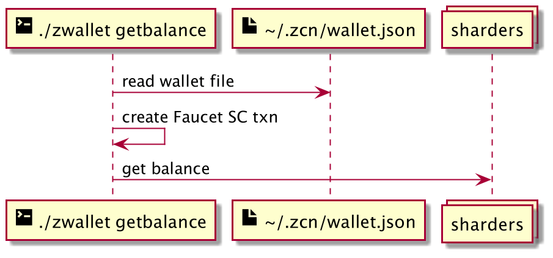
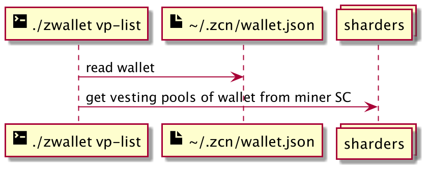

# zwallet - a CLI for 0chain wallet

`zwallet` is a command line interface (CLI) to demonstrate the functionalities of 0Chain.

The CLI utilizes the [0chain Go SDK](https://github.com/0chain/gosdk).

- [zwallet - a CLI for 0chain wallet](#zwallet---a-cli-for-0chain-wallet)
  - [Architecture](#architecture)
  - [Getting started](#getting-started)
    - [1. Installation](#1-installation)
    - [2. Run `zwallet` commands](#2-run-zwallet-commands)
  - [Global parameters](#global-parameters)
  - [Commands](#commands)
    - [Creating and restoring wallets](#creating-and-restoring-wallets)
      - [Creating wallet - (any command)](#creating-wallet---any-command)
      - [Recovering wallet - `recoverwallet`](#recovering-wallet---recoverwallet)
      - [Registering wallet - `register`](#registering-wallet---register)
      - [Creating multisig wallet - `createmswallet`](#creating-multisig-wallet---createmswallet)
    - [Exploring network nodes](#exploring-network-nodes)
      - [Listing all miners - `ls-miners`](#listing-all-miners---ls-miners)
      - [Listing all sharders -`ls-sharders`](#listing-all-sharders--ls-sharders)
      - [Listing all blobbers - `getblobbers`](#listing-all-blobbers---getblobbers)
      - [Getting node ID by URL - `getid`](#getting-node-id-by-url---getid)
    - [Getting and sending tokens](#getting-and-sending-tokens)
      - [Getting tokens with Faucet smart contract - `faucet`](#getting-tokens-with-faucet-smart-contract---faucet)
      - [Checking balance - `getbalance`](#checking-balance---getbalance)
      - [Sending tokens to another wallet - `send`](#sending-tokens-to-another-wallet---send)
      - [Verifying a transaction - `verify`](#verifying-a-transaction---verify)
    - [Staking on miners and sharders](#staking-on-miners-and-sharders)
      - [Getting the staking config - `mn-config`](#getting-the-staking-config---mn-config)
      - [Getting a miner or sharder info for staking - `mn-info`](#getting-a-miner-or-sharder-info-for-staking---mn-info)
      - [Locking a stake on a node - `mn-lock`](#locking-a-stake-on-a-node---mn-lock)
    - [Getting the stake pools of a wallet - `mn-user-info`](#getting-the-stake-pools-of-a-wallet---mn-user-info)
      - [Getting the stake pool info - `mn-pool-info`](#getting-the-stake-pool-info---mn-pool-info)
      - [Unlock a stake - `mn-unlock`](#unlock-a-stake---mn-unlock)
      - [Updating staking config of a node - `mn-update-settings`](#updating-staking-config-of-a-node---mn-update-settings)
    - [Vesting pool](#vesting-pool)
      - [Checking vesting pool config - `vp-config`](#checking-vesting-pool-config---vp-config)
      - [Adding a vesting pool - `vp-add`](#adding-a-vesting-pool---vp-add)
      - [Checking vesting pool list - `vp-list`](#checking-vesting-pool-list---vp-list)
      - [Checking vesting pool info - `vp-info`](#checking-vesting-pool-info---vp-info)
      - [Triggering a vesting pool work - `vp-trigger`](#triggering-a-vesting-pool-work---vp-trigger)
      - [Unlocking tokens of a vesting pool - `vp-unlock`](#unlocking-tokens-of-a-vesting-pool---vp-unlock)
      - [Stopping vesting for a destination - `vp-stop`](#stopping-vesting-for-a-destination---vp-stop)
      - [Deleting a vesting pool - `vp-delete`](#deleting-a-vesting-pool---vp-delete)
  - [Config](#config)
    - [~/.zcn/config.yaml](#zcnconfigyaml)
    - [(Optional) ~/.zcn/network.yaml](#optional-zcnnetworkyaml)
  - [Video resources](#video-resources)
  - [Troubleshooting](#troubleshooting)

## Architecture

`zwallet` can be configured to work with any 0chain network. It uses a config and a wallet file stored on the local filesystem.

For most transactions, `zwallet` uses the `0dns` to discover the network nodes, then creates and submits transaction(s) to the miners, and finally waits for transaction confirmation on the sharders.


## Getting started

### 1. Installation

**Prerequisites**

- go 1.13

**Procedures**

1. Clone the `zwalletcli` repo and install

```sh
git clone https://github.com/0chain/zwalletcli.git
cd zwalletcli
make install
```

2. Add config yaml at `~/.zcn/config.yaml`

The following script sets `https://beta.0chain.net` as your 0chain network.

```sh
cat > ~/.zcn/config.yaml << EOF
block_worker: https://beta.0chain.net/dns
signature_scheme: bls0chain
min_submit: 50 # in percentage
min_confirmation: 50 # in percentage
confirmation_chain_length: 3
EOF
```

To understand more about the config properties, head over [here](#zcnconfigyaml).

3. Run `zwallet` to display the list of supported commands.

```sh
./zwallet
```

----
For detailed steps on the installation, follow any of the following:

- [How to build on Linux](https://github.com/0chain/zwalletcli/wiki/Build-Linux)
- [How to build on Windows](https://github.com/0chain/zwalletcli/wiki/Build-Windows)

### 2. Run `zwallet` commands

The following steps assume that your terminal's working directory is inside the `zwalletcli` repo.

1. Get some tokens from faucet

To put tokens to your wallet, you can use the Faucet smart contract.

Run the `faucet` command to receive 1 token.

```sh
./zwallet faucet --methodName pour --input "need token"
```

```
Execute faucet smart contract success with txn :  915cfc6fa81eb3622c7082436a8ff752420e89dee16069a625d5206dc93ac3ca
```

Repeat the `faucet` command for 5 times to get 5 tokens balance.

2. Check wallet balance

Run the `getblance` command.

```sh
./zwallet getbalance
```

```
Balance: 5 (5.00 USD)
```

3. Lock tokens to gain interest

Run the `lock` command to lock some of your tokens to earn interest.  The following command lock `0.5` token for 5 minutes.

```sh
./zwallet lock --tokens 0.5 --durationMin 5
```

```
Tokens (0.500000) locked successfully
```

Check balance right after and see that the locked tokens is deducted but has already gained interest.

```sh
./zwallet getbalance
```

```
Balance: 4.5000004743 (4.5000004743 USD)
```

> Note: Tokens are not automatically released after lock duration. To get them back to wallet, need to run the `unlock` command. More info about this [here](#unlocking-tokens---unlock).

4. Stake tokens on a node to earn tokens

You can stake tokens on a blockchain node to earn more tokens.
Any miner or sharder can be staked on provided the node is not yet full.

In order to stake on a node, find out node's ID.
Both `ls-miners` and `ls-sharders` commands display the node IDs.

For example, run `ls-miners` command to see miners on the network.
```
./zwallet ls-miners
```

```
- ID:         cdb9b5a29cb5f48b350481694c4645c2db24500e3af210e22e2d10477a68bad2
- Host:       one.devnet-0chain.net
- Port:       31203
- ID:         3d9a10dac6fb3903d4a5283a42ae07b29d8e5d228afcce9bfc14e3e9dbc82748
- Host:       one.devnet-0chain.net
- Port:       31201
- ID:         aaa721d5fbf4ca83e20c8c40874ebcb144b86f57173633ff1702968677c2fa98
- Host:       one.devnet-0chain.net
- Port:       31202
```

With the selected node, run the `mn-lock` command to stake tokens on it.

```sh
./zwallet mn-lock --id cdb9b5a29cb5f48b350481694c4645c2db24500e3af210e22e2d10477a68bad2 --tokens 0.2
```

The output would print the stake pool id.

```sh
locked with: b488738546d84aed9d3dcb2bbe24c161bc4338638669e64e814631efd430fd85
```

> Note: If a given node has reached maximum number of delegates (stake pools), it can no longer accept a new stake pool. To find out if a node can support more, run `mn-info` command. More details [here](#getting-a-miner-or-sharder-info-for-staking---mn-info).

> Note: A stake pool does not immediately become active. It is activated only after the next view change cycle of the network. View change cycle is when the network refreshes the list of active nodes. More details on staking [here](#staking-on-miners-and-sharders).

To check if a stake pool is active, you can run `mn-pool-info` command. Normally, it would be activated in 5 minutes.

```sh
./zwallet mn-pool-info --id cdb9b5a29cb5f48b350481694c4645c2db24500e3af210e22e2d10477a68bad2
```

```json
{"stats":{"delegate_id":"822700aa95b6719281999c66d49764e6a258ff3bf259b83a62353615fd904829","high":0,"low":-1,"interest_paid":0,"reward_paid":0,"number_rounds":0,"status":"PENDING"},"pool":{"pool":{"id":"b488738546d84aed9d3dcb2bbe24c161bc4338638669e64e814631efd430fd85","balance":2000000000},"lock":{"delete_view_change_set":false,"delete_after_view_change":0,"owner":"822700aa95b6719281999c66d49764e6a258ff3bf259b83a62353615fd904829"}}}
```

Once it is active, check your balance to see earnings coming in.

5. Vesting tokens to another wallet

Vesting allows the transfer of tokens to one or more wallets. Tokens will be moved slowly to the wallet destinations until the time duration elapsed.

A good use case for vesting is when paying tokens to employees.

To vest tokens, first create another wallet which will be the token destinations.

Then get the client ID of that wallet.
```sh
cat ~/.zcn/vesting_wallet.json
```

Run the `vp-add` command to vest 2 tokens to that address in 5 minutes. Replace the client ID at `--d` parameter.

```
./zwallet vp-add --duration 5m --lock 2 --d 64f8afa591ecccaf271ece3973f8f749effb32f56e70e8f21422db26c37e0a67:2
```

```
Vesting pool added successfully: 2bba5b05949ea59c80aed3ac3474d7379d3be737e8eb5a968c52295e48333ead:vestingpool:c40fbad99c1d5201394e001c0dbe1533957e593885ecfeb62735ca3d9b1e572c
```

View the pool info and see that part of the tokens are now vested.
Those can be unlocked by the destination.

```
./zwallet vp-info --pool_id 2bba5b05949ea59c80aed3ac3474d7379d3be737e8eb5a968c52295e48333ead:vestingpool:c40fbad99c1d5201394e001c0dbe1533957e593885ecfeb62735ca3d9b1e572c
```

```
pool_id:      2bba5b05949ea59c80aed3ac3474d7379d3be737e8eb5a968c52295e48333ead:vestingpool:c40fbad99c1d5201394e001c0dbe1533957e593885ecfeb62735ca3d9b1e572c
balance:      2
can unlock:   0 (excess)
sent:         0 (real value)
pending:      2 (not sent, real value)
vested:       0.72 (virtual, time based value)
description:
start_time:   2021-06-05 01:43:11 +1000 AEST
expire_at:    2021-06-05 01:48:11 +1000 AEST
destinations:
  - id:          64f8afa591ecccaf271ece3973f8f749effb32f56e70e8f21422db26c37e0a67
    vesting:     2
    can unlock:  0.72 (virtual, time based value)
    sent:        0 (real value)
    pending:     2 (not sent, real value)
    vested:      0.72 (virtual, time based value)
    last unlock: 2021-06-05 01:43:11 +1000 AEST
client_id:    e51a5ee39a405c388a17232f3094c3773d8c97b3e49e701bdf04806494149ae2
```

After 5 minutes, all tokens should now be unlockable by destination wallet.
Use `vp-unlock` on the destination wallet to move tokens into the wallet.

```
./zwallet vp-unlock --wallet vesting_wallet.json --pool_id 2bba5b05949ea59c80aed3ac3474d7379d3be737e8eb5a968c52295e48333ead:vestingpool:c40fbad99c1d5201394e001c0dbe1533957e593885ecfeb62735ca3d9b1e572c
```

```
Tokens unlocked successfully.
```

Confirm balance of destination wallet.

```
./zwallet getbalance --wallet vesting_wallet.json
```

```
Balance: 2 (1.401328 USD)
```

6. Dispensing tokens from a multisig wallet

The CLI can be used to show that 0chain supports multisig wallet.
With multisig wallet, moving tokens need multiple approvals from its signatories.
This is perfect for dispensing funds of organization.

The `createmswallet` command creates a multisig wallet with the given number of signers and approval count threshold for transactions.
Once the multisig wallet is created, the command will do a token transfer from the multisig wallet.
Signers of the wallet will vote for the transaction.
Once enough votes are received, the transaction will automatically be transfered.

Sample command with 3 wallet signers and a threshold of 2 votes.

```sh
./zwallet createmswallet --numsigners 3 --threshold 2
```

First part of output shows 4 wallets are registered (3 signers + multisig wallet)

```
 registering 4 wallets

Successfully registered group wallet

Successfully registered signer wallet number 1


Successfully registered signer wallet number 2


Successfully registered signer wallet number 3
```

Next part of output shows multisig wallet is registered.

```
Multisig wallet SC registration requested. verifying status
MultisigSC  wallet SC registration request success
```

Next part shows start of vote.
Recipient wallet will be registered.
Then all wallets will be activated by pouring tokens into them.

```
testing voteRecipient test wallet:
{"client_id":"96b3dc0e88a552da07fdf75a653d4a2c7f629e001c904b3fb0492f2e69db0717","client_key":"f1b19476ec60b413bca66341537873318548701d16a8c0f49b7f6a88c0bf6c1f3852ea8dee5fde0eddb1e9ceb8c21c171f86e1ee39fee5d8aa3b177b5e7f9c24","keys":[{"public_key":"f1b19476ec60b413bca66341537873318548701d16a8c0f49b7f6a88c0bf6c1f3852ea8dee5fde0eddb1e9ceb8c21c171f86e1ee39fee5d8aa3b177b5e7f9c24","private_key":"7c11b4e4b9c658ffa2d3a890a28dcf9b6fa12214366e3fe5655a161ec86b650c"}],"mnemonics":"bring prize miracle rib again safe viable inhale pen member novel zoo outside quit shrug room perfect crisp canoe alien abandon old exchange kiwi","version":"1.0","date_created":"2021-05-07 21:56:41.788221 +1000 AEST m=+9.371315501"}

Activating group wallet by pouring test tokens
submitted transaction
Pour request success

Balance: 1

Activating signer wallet 1 by pouring test tokens
submitted transaction
Pour request success

Balance: 1

Activating signer wallet 2 by pouring test tokens
submitted transaction
Pour request success

Balance: 1

Activating signer wallet 3 by pouring test tokens
submitted transaction
Pour request success

Balance: 1
Checking balance on group wallet with clientID 558199083b7ea6f823dd7643b448751edec0b172336cc7081b426685f68fe58e before the vote
Balance: 1
```

Last part shows the votes from signers to transfer from multisig wallet, and finally balances are checked to confirm transfer occurred.
```
Created Vote#1 from signer #0:
{"proposal_id":"testing MSVoting","transfer":{"from":"558199083b7ea6f823dd7643b448751edec0b172336cc7081b426685f68fe58e","to":"96b3dc0e88a552da07fdf75a653d4a2c7f629e001c904b3fb0492f2e69db0717","amount":1000000000},"signature":"6fdbda2a3a338183d9082dc786b83f8a9d146997bb8d4bb79d4a73c24b74e395"}

Multisig Vote registration requested. verifying status
Multisig Voting success

Created Vote#2 from signer #1:
{"proposal_id":"testing MSVoting","transfer":{"from":"558199083b7ea6f823dd7643b448751edec0b172336cc7081b426685f68fe58e","to":"96b3dc0e88a552da07fdf75a653d4a2c7f629e001c904b3fb0492f2e69db0717","amount":1000000000},"signature":"1318d95df3b32f47f7adf38e6d3bd142f400e6fb5cdf7968e1ac2e02b967a208"}

Multisig Vote registration requested. verifying status
Multisig Voting success


Checking balance on group wallet 558199083b7ea6f823dd7643b448751edec0b172336cc7081b426685f68fe58e after the vote
Balance: 0.9

Checking balance on recipient wallet after the vote
Balance: 0.1

Creating and testing a multisig wallet is successful!
```

That's it! You are now ready to use `zwallet`.

## Global parameters

`zwallet` accept global parameters to override default configuration and can be used in any command.

| Parameter     | Description                     | Default        |
| ------------- | ------------------------------- | -------------- |
| `--help`      | Show help                       |                |
| `--config`    | [Config file](#zcnconfigyaml)   | `config.yaml`  |
| `--configDir` | Config directory                | `~/.zcn`       |
| `--network`   | [Network file](#zcnnetworkyaml) | `network.yaml` |
| `--verbose`   | Enable verbose logging          | `false`        |
| `--wallet`    | Wallet file                     | `wallet.json`  |

## Commands

### Creating and restoring wallets

#### Creating wallet - (any command)

Simply run any `zwallet` command and it will create a wallet if none exist yet.


Here is a sample with `faucet` command and this creates a wallet at default location`~/.zcn/wallet.json`

```sh
./zwallet faucet --methodName pour --input "new wallet"
```

Another `faucet` command to create a second wallet at `~/.zcn/new_wallet.json`

```sh
./zwallet faucet --methodName pour --input "new wallet" --wallet new_wallet.json
```

Sample Output
```
No wallet in path  <home directory>/.zcn/new_wallet.json found. Creating wallet...
ZCN wallet created!!
Creating related read pool for storage smart-contract...
Read pool created successfully
```

Verify second wallet

```sh
cat ~/.zcn/new_wallet.json
```

#### Recovering wallet - `recoverwallet`

`recoverwallet` is used when restoring a lost wallet or when loading the wallet from a different computer.

Given a wallet's mnemonics, you can recover and recreate your wallet.

| Parameter    | Required | Description                            | Default | Valid Values |
| ------------ | -------- | -------------------------------------- | ------- | ------------ |
| `--mnemonic` | Yes      | The mnemonics of the wallet to recover |         |              |
| `--offline`  | No       | recover wallet without registration on blockchain|  false  |              |


Sample command

```sh
./zwallet recoverwallet --wallet recovered_wallet.json --mnemonic "pull floor crop best weasel suit solid gown filter kitten loan absent noodle nation potato planet demise online ten affair rich panel rent sell"
```

Sample output

```
Wallet recovered!!
```

Verify recovered wallet

```sh
cat ~/.zcn/recovered_wallet.json
```

#### Registering wallet - `register`

`register` is used when needed to register a given wallet to the blockchain. This could be that the blockchain network is reset and you wished to register the same wallet at `~/.zcn/wallet.json`.


Sample command

```sh
./zwallet register
```

Sample output

```
Wallet registered
```

#### Creating multisig wallet - `createmswallet`

A multi-signature (multisig) wallet is supported by the chain through the Multisig smart contract.

A multisig wallet is a wallet where transactions are voted by its configured signers. A multisig wallet is created by providing the list of signer public keys and the minimum number of votes required to fully signed a transaction.

The Multisig smart contract allows the registration of new multisig wallets, and allows the signers to propose and vote a multisig wallet transactions.

`createmswallet` demonstrates the multisig functionality by using the following SDK functions.

- RegisterMultiSig - registers the multisig/group wallet with the list of signers. All wallets must be registered already.

- RegisterVote - votes for a proposal. This creates a proposal if does not exist and can be used by other signers to add vote. When the threshold number of votes are registered, transaction will be automatically processed. Any extra votes will be ignored.

> Note: Proposals have an expiry of 7 days from the time of creation. At this point, it cannot be changed. Any vote coming after the expiry may create a new proposal.

> Note: Before a transaction or voting can happen, the group wallet and the signer wallets have to be activated, not just registered. To activate, the wallets must have received tokens.

| Parameter      | Required | Description                                                  | Default | Valid Values |
| -------------- | -------- | ------------------------------------------------------------ | ------- | ------------ |
| `--numsigners` | Yes      | The number of signers of the multisig wallet                 |         |              |
| `--threshold`  | Yes      | The number of signers required to vote a transaction         |         |              |
| `--testn`      | No       | Whether to have all signers vote on the test transation, otherwise just the minimum threshold | false
| `--offline`    | No       | create multiwallet without registration on blockchain        |  false  |              |


Sample command with 3 wallet signers and a threshold of 2 votes.

```sh
./zwallet createmswallet --numsigners 3 --threshold 2
```

Sample output. 4 wallets are registered (3 signers + multisig wallet)

```sh
 registering 4 wallets

Successfully registered group wallet

Successfully registered signer wallet number 1


Successfully registered signer wallet number 2


Successfully registered signer wallet number 3


Multisig wallet SC registration requested. verifying status
MultisigSC  wallet SC registration request success


testing voteRecipient test wallet:
{"client_id":"96b3dc0e88a552da07fdf75a653d4a2c7f629e001c904b3fb0492f2e69db0717","client_key":"f1b19476ec60b413bca66341537873318548701d16a8c0f49b7f6a88c0bf6c1f3852ea8dee5fde0eddb1e9ceb8c21c171f86e1ee39fee5d8aa3b177b5e7f9c24","keys":[{"public_key":"f1b19476ec60b413bca66341537873318548701d16a8c0f49b7f6a88c0bf6c1f3852ea8dee5fde0eddb1e9ceb8c21c171f86e1ee39fee5d8aa3b177b5e7f9c24","private_key":"7c11b4e4b9c658ffa2d3a890a28dcf9b6fa12214366e3fe5655a161ec86b650c"}],"mnemonics":"bring prize miracle rib again safe viable inhale pen member novel zoo outside quit shrug room perfect crisp canoe alien abandon old exchange kiwi","version":"1.0","date_created":"2021-05-07 21:56:41.788221 +1000 AEST m=+9.371315501"}

Activating group wallet by pouring test tokens
submitted transaction
Pour request success

Balance: 1

Activating signer wallet 1 by pouring test tokens
submitted transaction
Pour request success

Balance: 1

Activating signer wallet 2 by pouring test tokens
submitted transaction
Pour request success

Balance: 1

Activating signer wallet 3 by pouring test tokens
submitted transaction
Pour request success

Balance: 1
Checking balance on group wallet with clientID 558199083b7ea6f823dd7643b448751edec0b172336cc7081b426685f68fe58e before the vote
Balance: 1

Created Vote#1 from signer #0:
{"proposal_id":"testing MSVoting","transfer":{"from":"558199083b7ea6f823dd7643b448751edec0b172336cc7081b426685f68fe58e","to":"96b3dc0e88a552da07fdf75a653d4a2c7f629e001c904b3fb0492f2e69db0717","amount":1000000000},"signature":"6fdbda2a3a338183d9082dc786b83f8a9d146997bb8d4bb79d4a73c24b74e395"}

Multisig Vote registration requested. verifying status
Multisig Voting success

Created Vote#2 from signer #1:
{"proposal_id":"testing MSVoting","transfer":{"from":"558199083b7ea6f823dd7643b448751edec0b172336cc7081b426685f68fe58e","to":"96b3dc0e88a552da07fdf75a653d4a2c7f629e001c904b3fb0492f2e69db0717","amount":1000000000},"signature":"1318d95df3b32f47f7adf38e6d3bd142f400e6fb5cdf7968e1ac2e02b967a208"}

Multisig Vote registration requested. verifying status
Multisig Voting success


Checking balance on group wallet 558199083b7ea6f823dd7643b448751edec0b172336cc7081b426685f68fe58e after the vote
Balance: 0.9

Checking balance on recipient wallet after the vote
Balance: 0.1

Creating and testing a multisig wallet is successful!
```


### Exploring network nodes

#### Listing all miners - `ls-miners`

The list of miners are retrieved using the Miner smart contract.

| Parameter | Required | Description          | Default | Valid Values      |
| --------- | -------- | -------------------- | ------- | ----------------- |
| `--json`  | No       | Print output as JSON |         | <empty to enable> |


```sh
./zwallet ls-miners
```

Sample output

```
- ID:         cdb9b5a29cb5f48b350481694c4645c2db24500e3af210e22e2d10477a68bad2
- Host:       one.devnet-0chain.net
- Port:       31203
- ID:         3d9a10dac6fb3903d4a5283a42ae07b29d8e5d228afcce9bfc14e3e9dbc82748
- Host:       one.devnet-0chain.net
- Port:       31201
- ID:         aaa721d5fbf4ca83e20c8c40874ebcb144b86f57173633ff1702968677c2fa98
- Host:       one.devnet-0chain.net
- Port:       31202
```

#### Listing all sharders -`ls-sharders`

The list of sharders are retrieved using the latest finalized magic block. All registered sharders can be retrieved with the `--all` parameter.

| Parameter | Required | Description                             | Default | Valid Values      |
| --------- | -------- | --------------------------------------- | ------- | ----------------- |
| `--json`  | No       | Print output as JSON                    |         | <empty to enable> |
| `--all`   | No       | Print also registered nodes on Miner SC |         | <empty to enable> |


```sh
./zwallet ls-sharders --all
```

Sample output

```
MagicBlock Sharders
ID: 12e317e5d7a4a0a914ec26074e28f00502c735ddf7ac7d156b34e83e39792a9d
  - N2NHost: one.devnet-0chain.net
  - Host: one.devnet-0chain.net
  - Port: 31102
ID: 675502b613ba1c5985636e3e92b9a857855a52155e3316bb40fe9607e14167fb
  - N2NHost: one.devnet-0chain.net
  - Host: one.devnet-0chain.net
  - Port: 31101

Registered Sharders
ID: 675502b613ba1c5985636e3e92b9a857855a52155e3316bb40fe9607e14167fb
  - N2NHost: one.devnet-0chain.net
  - Host: one.devnet-0chain.net
  - Port: 31101
ID: 12e317e5d7a4a0a914ec26074e28f00502c735ddf7ac7d156b34e83e39792a9d
  - N2NHost: one.devnet-0chain.net
  - Host: one.devnet-0chain.net
  - Port: 31102
ID: 43f4f011698db6f2078e6ceb1cd981ab3bd35d07b7ac6fdf7c77aec1feee09be
  - N2NHost: 144.76.91.241
  - Host: test4.devnet-0chain.net
  - Port: 31101
ID: fd02f4436692bd9f679fae809f4f140fd4daaa35769ae9c6db1ab9664f766c22
  - N2NHost: 144.76.91.241
  - Host: test4.devnet-0chain.net
  - Port: 31102

```

#### Listing all blobbers - `getblobbers`

The list of blobbers are retrieved using the Storage smart contract.


```sh
./zwallet getblobbers
```

Sample output

```
Blobbers:
                 URL                 |                                ID                                |          CAP           |     R / W PRICE     | DEMAND
+------------------------------------+------------------------------------------------------------------+------------------------+---------------------+--------+
  http://one.devnet-0chain.net:31305 | 011a5444c9fe53137da7c3d871f3bf4bbf3c01607b14aa95ff2de43b5537d4b6 | 271.5 GiB / 1000.0 GiB | 0.010000 / 0.010000 |    0.1
  http://one.devnet-0chain.net:31306 | 2efc85d6a2f36380e1e77b843cd9f4fe55668271cae4925ab38a92504176e5df | 107.8 GiB / 1000.0 GiB | 0.010000 / 0.010000 |    0.1
  http://one.devnet-0chain.net:31302 | 34934babf0781c21736023ff89bc554928d77c028a968ef7344a460611d5a8d2 | 104.3 GiB / 1000.0 GiB | 0.010000 / 0.010000 |    0.1
```

#### Getting node ID by URL - `getid`

Print the ID of a blockchain node.

| Parameter | Required | Description                               | Default | Valid Values |
| --------- | -------- | ----------------------------------------- | ------- | ------------ |
| `--url`   | Yes      | URL to the node (miner, sharder, blobber) |         |              |


The following command get the details of the sharder on a given URL

```sh
./zwallet getid --url http://one.devnet-0chain.net:31101
```

Output

```
URL: http://one.devnet-0chain.net:31101
ID: 675502b613ba1c5985636e3e92b9a857855a52155e3316bb40fe9607e14167fb
```

### Getting and sending tokens

[Video walkthrough](https://youtu.be/Eiz9mqdFtZo)

#### Getting tokens with Faucet smart contract - `faucet`

Tokens can be retrieved and added to your wallet through the Faucet smart contract.

| Parameter      | Required | Description                                                  | Default | Valid Values     |
| -------------- | -------- | ------------------------------------------------------------ | ------- | ---------------- |
| `--methodName` | Yes      | Smart Contract method to call (`pour` - get tokens, `refill` - return tokens) |         | `pour`, `refill` |
| `--input`      | Yes      | Request description                                          |         | any string       |
| `--tokens`     | No       | Amount of tokens (maximum of 1.0)                            | 1.0     | (0 - 1.0]        |


The following command will give 1 token to the default wallet.

```sh
./zwallet faucet --methodName pour --input "need token"
```

The following command will return 0.5 token to faucet.

```sh
./zwallet faucet --methodName refill --input "not using" --tokens 0.5
```

Sample output from `faucet` prints the transaction

```
Execute faucet smart contract success with txn :  d25acd4a339f38a9ce4d1fa91b287302fab713ef4385522e16d18fd147b2ebaf
```

#### Checking balance - `getbalance`

Wallet balances are retrieved from sharders.

> Note: Balance would not show any [locked tokens](#locking-tokens-for-interest---lock).



```sh
./zwallet getbalance
```

Sample output

```
Balance: 3 (4.2299999999999995 USD)
```

To check the balance of another wallet, use `--wallet` global parameter.

```sh
./zwallet getbalance --wallet another_wallet.json
```

> Note: When there is no token on the wallet yet, output will show `Get balance failed.`

#### Sending tokens to another wallet - `send`


Transferring tokens from a wallet to another is done through `send`

| Parameter        | Required | Description                    | Default | Valid Values |
| ---------------- | -------- | ------------------------------ | ------- | ------------ |
| `--to_client_id` | Yes      | Client ID of the recipient     |         |              |
| `--tokens`       | Yes      | Amount of tokens to send       |         | valid number |
| `--desc`         | Yes      | Transfer description           |         | any string   |
| `--fee`          | No       | Amount of tokens to use as fee | 0.0     | valid number |

The following sends 0.2 token from the default wallet to the specified client ID.

```sh
./zwallet send --to_client_id e7ebb698213b6bda097c0a14ccbe574356e99e9b666e4baeae540da1d9b51e7e --tokens .2 --desc "gift"
```

Output

```
Send tokens success
```

To use a different wallet as sender, use `--wallet` global parameter.

```sh
./zwallet send --to_client_id e7ebb698213b6bda097c0a14ccbe574356e99e9b666e4baeae540da1d9b51e7e --tokens .2 --desc "gift" --wallet another_wallet.json
```

#### Verifying a transaction - `verify`

`verify` checks whether a given transaction hash was confirmed on the blockchain.

| Parameter | Required | Description                   | Default | Valid Values           |
| --------- | -------- | ----------------------------- | ------- | ---------------------- |
| `--hash`  | Yes      | Hash of transaction to verify |         | valid transaction hash |

Note: Not all `zwallet` commands (eg. `send`) prints the transaction hash created. To see more details printed including the hashes, use `--verbose` global parameter.


Sample command

```sh
./zwallet verify --hash 867c240b640e3d128643330af383cb3a0a229ebce08cae667edd7766c7ccc850
```

Output

```
Transaction verification success
```

To see more details about the transaction on `verify`, use `--verbose` global parameter.

```sh
./zwallet verify --hash 867c240b640e3d128643330af383cb3a0a229ebce08cae667edd7766c7ccc850 --verbose
```

### Staking on miners and sharders

[Miner smart contract](https://github.com/0chain/0chain/blob/master/code/go/0chain.net/smartcontract/minersc/READEME.md) allows staking on the miner and sharder nodes.

The maximum number of stake pools per node is limited to the number of delegates allowed. To find out the number of delegates and the minimum and maximum tokens allowed, query the staking config.

#### Getting the staking config - `mn-config`

`mn-config` display the global info of Miner SC for staking.


```sh
./zwallet mn-config
```

Sample output

```
view_change:           0
max_n:                 8
min_n:                 2
max_s:                 3
min_s:                 1
t_percent:             0.51
k_percent:             0.75
last_round:            5527098
max_stake:             100
min_stake:             0
interest_rate:         5.55e-07
reward_rate:           1
share_ratio:           0.8
block_reward:          0.21
max_charge:            0.5
epoch:                 15000000
reward_decline_rate:   0.1
interest_decline_rate: 0.1
max_mint:              4000000
minted:                928552.464
max_delegates:         200
```

#### Getting a miner or sharder info for staking - `mn-info`

Node stats for staking are retrieved from Miner SC.

| Parameter | Required | Description                                                  | Default | Valid Values |
| --------- | -------- | ------------------------------------------------------------ | ------- | ------------ |
| `--id`    | Yes      | Node ID of a miner or sharder (get at `ls-miners` or `ls-sharders`) |         |              |


Sample command

```sh
./zwallet mn-info --id 68ed8f16e1d50e3217425b3e98fb7a39e5d7201fe4b1dccfe8477b5c54761b24
```

Sample output

```json
{"simple_miner":{"id":"68ed8f16e1d50e3217425b3e98fb7a39e5d7201fe4b1dccfe8477b5c54761b24","n2n_host":"five.devnet-0chain.net","host":"five.devnet-0chain.net","port":31102,"path":"sharder02","public_key":"458170c28496333426f9866989f7b335564d13d00f50db503275e7ec50a008031764ba5df42c20c85d76e7fe7eda43f39afdb650b8ffa9ed340e6fc50c35ae22","short_name":"localhost.s02","build_tag":"50fb047353c4c3d268c0e0ebfd8e63f1d10c6813","total_stake":0,"delegate_wallet":"68ed8f16e1d50e3217425b3e98fb7a39e5d7201fe4b1dccfe8477b5c54761b24","service_charge":0.1,"number_of_delegates":10,"min_stake":0,"max_stake":1000000000000,"stat":{"sharder_rewards":1160553450000000},"node_type":"sharder","last_health_check":1619554377},"pending":{"01978379a586de2882638345e215baaf8382093609d910da5ac1a833e2814f6f":{"stats":{"delegate_id":"133807913c66ec0b4342612f23fecd1852b456152433b8380cd2abcd411d4c07","high":0,"low":-1,"interest_paid":0,"reward_paid":0,"number_rounds":0,"status":"PENDING"},"pool":{"pool":{"id":"01978379a586de2882638345e215baaf8382093609d910da5ac1a833e2814f6f","balance":10000000000},"lock":{"delete_view_change_set":false,"delete_after_view_change":0,"owner":"ff12c78ee4a985b4fc2ac52ec8a24e9df2bd912636da15437b0eb7707b99abf4"}}}}}
```

Reformatted output

```json
{
  "simple_miner":{
    "id":"68ed8f16e1d50e3217425b3e98fb7a39e5d7201fe4b1dccfe8477b5c54761b24",
    "n2n_host":"five.devnet-0chain.net",
    "host":"five.devnet-0chain.net",
    "port":31102,
    "path":"sharder02",
    "public_key":"458170c28496333426f9866989f7b335564d13d00f50db503275e7ec50a008031764ba5df42c20c85d76e7fe7eda43f39afdb650b8ffa9ed340e6fc50c35ae22",
    "short_name":"localhost.s02",
    "build_tag":"50fb047353c4c3d268c0e0ebfd8e63f1d10c6813",
    "total_stake":0,
    "delegate_wallet":"68ed8f16e1d50e3217425b3e98fb7a39e5d7201fe4b1dccfe8477b5c54761b24",
    "service_charge":0.1,
    "number_of_delegates":10,
    "min_stake":0,
    "max_stake":1000000000000,
    "stat":{
      "sharder_rewards":1160553450000000
    },
    "node_type":"sharder",
    "last_health_check":1619554377
  },
  "pending":{
    "01978379a586de2882638345e215baaf8382093609d910da5ac1a833e2814f6f":{
      "stats":{
        "delegate_id":"133807913c66ec0b4342612f23fecd1852b456152433b8380cd2abcd411d4c07",
        "high":0,
        "low":-1,
        "interest_paid":0,
        "reward_paid":0,
        "number_rounds":0,
        "status":"PENDING"
      },
      "pool":{
        "pool":{
          "id":"01978379a586de2882638345e215baaf8382093609d910da5ac1a833e2814f6f",
          "balance":10000000000
        },
        "lock":{
          "delete_view_change_set":false,
          "delete_after_view_change":0,
          "owner":"ff12c78ee4a985b4fc2ac52ec8a24e9df2bd912636da15437b0eb7707b99abf4"
        }
      }
    }
  }
}
```

#### Locking a stake on a node - `mn-lock`

Staking tokens on a node gains additional tokens over time. Tokens locked for staking can be unlocked anytime although have to wait for the next view change cycle.

Note however that if a node becomes offline, all stake pools are automatically unlocked and tokens are returned to wallets.

| Parameter  | Required | Description                                                  | Default | Valid Values |
| ---------- | -------- | ------------------------------------------------------------ | ------- | ------------ |
| `--id`     | Yes      | Node ID of a miner or sharder to stake for (get at `ls-miners` or `ls-sharders`) |         |              |
| `--tokens` | Yes      | Amounts of token to stake                                    |         | valid number |


Sample command

```sh
./zwallet mn-lock --id dc8c6c93fb42e7f6d1c0f93baf66cc77e52725f79c3428a37da28e294aa2319a --tokens 1
```

The output would print the stake pool id.

```sh
locked with: b488738546d84aed9d3dcb2bbe24c161bc4338638669e64e814631efd430fd85
```

If the locking of stakes is failing, verify the following.

1. Wallet has enough tokens
2. Node ID is valid
3. Node has available delegate

### Getting the stake pools of a wallet - `mn-user-info`

| Parameter     | Required | Description             | Default                        | Valid Values      |
| ------------- | -------- | ----------------------- | ------------------------------ | ----------------- |
| `--client_id` | No       | Client ID of the wallet | Wallet at `~/.zcn/wallet.json` |                   |
| `--json`      | No       | Print output as JSON    |                                | <empty to enable> |


Sample command

```sh
./zwallet mn-user-info
```

Sample output

```
- node: dc8c6c93fb42e7f6d1c0f93baf66cc77e52725f79c3428a37da28e294aa2319a (sharder)
  - pool_id:        b488738546d84aed9d3dcb2bbe24c161bc4338638669e64e814631efd430fd85
    balance:        1
    interests paid: 0
    rewards paid:   0
    status:         pending
    stake %:        100 %
```

Sample reformatted JSON output

```json
{
  "pools":{
    "sharder":{
      "dc8c6c93fb42e7f6d1c0f93baf66cc77e52725f79c3428a37da28e294aa2319a":[
        {
          "id":"b488738546d84aed9d3dcb2bbe24c161bc4338638669e64e814631efd430fd85",
          "balance":10000000000,
          "interest_paid":0,
          "reward_paid":0,
          "status":"PENDING",
          "high":0,
          "low":-1
        }
      ]
    }
  }
}
```

#### Getting the stake pool info - `mn-pool-info`

| Parameter   | Required | Description                                                  | Default | Valid Values |
| ----------- | -------- | ------------------------------------------------------------ | ------- | ------------ |
| `--id`      | Yes      | Node ID of a miner or sharder (get at `ls-miners` or `ls-sharders`) |         |              |


Sample command

```sh
./zwallet mn-pool-info --id dc8c6c93fb42e7f6d1c0f93baf66cc77e52725f79c3428a37da28e294aa2319a
```

Sample output

```json
{"stats":{"delegate_id":"822700aa95b6719281999c66d49764e6a258ff3bf259b83a62353615fd904829","high":0,"low":-1,"interest_paid":0,"reward_paid":0,"number_rounds":0,"status":"PENDING"},"pool":{"pool":{"id":"b488738546d84aed9d3dcb2bbe24c161bc4338638669e64e814631efd430fd85","balance":10000000000},"lock":{"delete_view_change_set":false,"delete_after_view_change":0,"owner":"822700aa95b6719281999c66d49764e6a258ff3bf259b83a62353615fd904829"}}}
```

Reformatted output

```json
{
  "stats":{
    "delegate_id":"822700aa95b6719281999c66d49764e6a258ff3bf259b83a62353615fd904829",
    "high":0,
    "low":-1,
    "interest_paid":0,
    "reward_paid":0,
    "number_rounds":0,
    "status":"PENDING"
  },
  "pool":{
    "pool":{
      "id":"b488738546d84aed9d3dcb2bbe24c161bc4338638669e64e814631efd430fd85",
      "balance":10000000000
    },
    "lock":{
      "delete_view_change_set":false,
      "delete_after_view_change":0,
      "owner":"822700aa95b6719281999c66d49764e6a258ff3bf259b83a62353615fd904829"
    }
  }
}
```

#### Unlock a stake - `mn-unlock`

| Parameter   | Required | Description                                                  | Default | Valid Values |
| ----------- | -------- | ------------------------------------------------------------ | ------- | ------------ |
| `--id`      | Yes      | Node ID of a miner or sharder to unlock stakes from (get at `mn-user-info`) |         |              |


```sh
./zwallet mn-unlock --id dc8c6c93fb42e7f6d1c0f93baf66cc77e52725f79c3428a37da28e294aa2319a
```

Output

```
tokens will be unlocked next VC
```

Tokens are released on the next view change cycle or at the next reward round.


#### Updating staking config of a node - `mn-update-settings`

Staking config can only be updated by the node's delegate wallet.

| Parameter         | Required | Description                                   | Default | Valid Values |
| ----------------- | -------- | --------------------------------------------- | ------- | ------------ |
| `--id`            | Yes      | Node ID of a miner or sharder                 |         |              |
| `--max_stake`     | No       | Minimum amount of tokens allowed when staking |         | valid number |
| `--min_stake`     | No       | Maximum amount of tokens allowed when staking |         | valid number |
| `--num_delegates` | No       | Maximum number of staking pools               |         | valid number |


Sample command

```sh
./zwallet mn-update-settings --id dc8c6c93fb42e7f6d1c0f93baf66cc77e52725f79c3428a37da28e294aa2319a --max_stake 1000000000000 --min_stake 10000000 --num_delegates 25
```

### Vesting pool

Vesting pool allows the transfer of locked tokens to one or more wallets on a pace set by the pool duration.

#### Checking vesting pool config - `vp-config`

Display the Vesting Pool smart contract config.


```sh
./zwallet vp-config
```

Sample output

```
min_lock: 0.01
min_duration: 2m0s
max_duration: 2h0m0s
max_destinations: 3
max_description_length: 20
```

#### Adding a vesting pool - `vp-add`

Create a new vesting pool.

| Parameter       | Required | Description                                                  | Default | Valid Values                                                 |
| --------------- | -------- | ------------------------------------------------------------ | ------- | ------------------------------------------------------------ |
| `--d`           | Yes      | Pair of destination wallet and amount of tokens (repeat parameter for more pairs) |         | value pattern: `<wallet_client_id>:<amount>`                 |
| `--duration`    | Yes      | Vesting pool duration                                        |         | eg. "5m" for 5 minutes, "1h" for 1 hour (should be within min and max allowed duration) |
| `--lock`        | Yes      | Amount of tokens to lock on the pool                         |         | Should fit the destination amounts and must meet minimum lock amount |
| `--description` | No       | Vesting pool description                                     |         |                                                              |
| `--fee`         | No       | Amount of tokens to use as fee                               | 0.0     | valid number                                                 |
| `--start_time`  | No       | When to start the vesting pool                               | now     | Unix time in seconds                                         |


Sample command

```
./zwallet vp-add --duration 5m --lock 5 --d af6c894e2f5dd76b6df1329e924b4177e58692d165090f52b0cc11c639b3bb92:1 --d 8c4e3623964442e7ff9b9f52e5e7a5d8248a85856cf369f71149b7b922653396:2
```

Sample output

```
Vesting pool added successfully: 2bba5b05949ea59c80aed3ac3474d7379d3be737e8eb5a968c52295e48333ead:vestingpool:0cf77bb1e4b9d71968b84be60ca49b25d20da9f446985e2450c1145ea0f5964d
```

> Note: The destination wallets should be registered already on the blockchain.

#### Checking vesting pool list - `vp-list`

Display the vesting pools of wallet.

| Parameter     | Required | Description             | Default                        | Valid Values |
| ------------- | -------- | ----------------------- | ------------------------------ | ------------ |
| `--client_id` | No       | Client ID of the wallet | Wallet at `~/.zcn/wallet.json` |              |



Sample command

```sh
./zwallet vp-list
```

Sample output

```
-  2bba5b05949ea59c80aed3ac3474d7379d3be737e8eb5a968c52295e48333ead:vestingpool:0cf77bb1e4b9d71968b84be60ca49b25d20da9f446985e2450c1145ea0f5964d
```

#### Checking vesting pool info - `vp-info`

Display vesting pool information.

| Parameter   | Required | Description        | Default | Valid Values |
| ----------- | -------- | ------------------ | ------- | ------------ |
| `--pool_id` | Yes      | ID of vesting pool |         |              |


Sample command

```sh
./zwallet vp-info --pool_id 2bba5b05949ea59c80aed3ac3474d7379d3be737e8eb5a968c52295e48333ead:vestingpool:0cf77bb1e4b9d71968b84be60ca49b25d20da9f446985e2450c1145ea0f5964d
```

Sample output

```
pool_id:      2bba5b05949ea59c80aed3ac3474d7379d3be737e8eb5a968c52295e48333ead:vestingpool:0cf77bb1e4b9d71968b84be60ca49b25d20da9f446985e2450c1145ea0f5964d
balance:      5
can unlock:   2 (excess)
sent:         0 (real value)
pending:      3 (not sent, real value)
vested:       3 (virtual, time based value)
description:
start_time:   2021-05-08 00:06:00 +1000 AEST
expire_at:    2021-05-08 00:11:00 +1000 AEST
destinations:
  - id:          af6c894e2f5dd76b6df1329e924b4177e58692d165090f52b0cc11c639b3bb92
    vesting:     1
    can unlock:  1 (virtual, time based value)
    sent:        0 (real value)
    pending:     1 (not sent, real value)
    vested:      1 (virtual, time based value)
    last unlock: 2021-05-08 00:06:00 +1000 AEST
  - id:          8c4e3623964442e7ff9b9f52e5e7a5d8248a85856cf369f71149b7b922653396
    vesting:     2
    can unlock:  2 (virtual, time based value)
    sent:        0 (real value)
    pending:     2 (not sent, real value)
    vested:      2 (virtual, time based value)
    last unlock: 2021-05-08 00:06:00 +1000 AEST
client_id:    e6bca3f65f3ac102cd972ee2a85c4ee8318fd63cce91f14a76e81d024451213e
```

#### Triggering a vesting pool work - `vp-trigger`

Pool owner can trigger a vesting pool to transfer to the destinations right away.

| Parameter   | Required | Description        | Default | Valid Values |
| ----------- | -------- | ------------------ | ------- | ------------ |
| `--pool_id` | Yes      | ID of vesting pool |         |              |


Sample command

```sh
./zwallet vp-trigger --pool_id 2bba5b05949ea59c80aed3ac3474d7379d3be737e8eb5a968c52295e48333ead:vestingpool:0cf77bb1e4b9d71968b84be60ca49b25d20da9f446985e2450c1145ea0f5964d
```

Sample output

```
Vesting triggered successfully.
```

Vesting pool info should not show tokens in `sent`.

```
./zwallet vp-info --pool_id 2bba5b05949ea59c80aed3ac3474d7379d3be737e8eb5a968c52295e48333ead:vestingpool:0cf77bb1e4b9d71968b84be60ca49b25d20da9f446985e2450c1145ea0f5964d
pool_id:      2bba5b05949ea59c80aed3ac3474d7379d3be737e8eb5a968c52295e48333ead:vestingpool:0cf77bb1e4b9d71968b84be60ca49b25d20da9f446985e2450c1145ea0f5964d
balance:      2
can unlock:   2 (excess)
sent:         3 (real value)
pending:      0 (not sent, real value)
vested:       3 (virtual, time based value)
description:
start_time:   2021-05-08 00:06:00 +1000 AEST
expire_at:    2021-05-08 00:11:00 +1000 AEST
destinations:
  - id:          af6c894e2f5dd76b6df1329e924b4177e58692d165090f52b0cc11c639b3bb92
    vesting:     1
    can unlock:  0 (virtual, time based value)
    sent:        1 (real value)
    pending:     0 (not sent, real value)
    vested:      1 (virtual, time based value)
    last unlock: 2021-05-08 00:11:00 +1000 AEST
  - id:          8c4e3623964442e7ff9b9f52e5e7a5d8248a85856cf369f71149b7b922653396
    vesting:     2
    can unlock:  0 (virtual, time based value)
    sent:        2 (real value)
    pending:     0 (not sent, real value)
    vested:      2 (virtual, time based value)
    last unlock: 2021-05-08 00:11:00 +1000 AEST
client_id:    e6bca3f65f3ac102cd972ee2a85c4ee8318fd63cce91f14a76e81d024451213e
```

#### Unlocking tokens of a vesting pool - `vp-unlock`

Unlocking tokens from a vesting pool can be done by both owner and destination wallet

- owner can unlock tokens not yet vested
- destination can unlock tokens already vested

| Parameter   | Required | Description        | Default | Valid Values |
| ----------- | -------- | ------------------ | ------- | ------------ |
| `--pool_id` | Yes      | ID of vesting pool |         |              |


Sample command by a destination wallet

```sh
./zwallet vp-unlock --pool_id 2bba5b05949ea59c80aed3ac3474d7379d3be737e8eb5a968c52295e48333ead:vestingpool:1d9d6b07a792f967b24cfaf6c60dc372193c59946af07e41282426c6b12ea1b2
```

Sample output

```
Tokens unlocked successfully.
```

#### Stopping vesting for a destination - `vp-stop`

Owner can stop vesting for a destination and unlock the rest of tokens not yet vested.

| Parameter   | Required | Description        | Default | Valid Values     |
| ----------- | -------- | ------------------ | ------- | ---------------- |
| `--d`       | Yes      | Destination wallet |         | wallet client ID |
| `--pool_id` | Yes      | ID of vesting pool |         |                  |


Sample command

```sh
./zwallet vp-stop --d af6c894e2f5dd76b6df1329e924b4177e58692d165090f52b0cc11c639b3bb92 --pool_id 2bba5b05949ea59c80aed3ac3474d7379d3be737e8eb5a968c52295e48333ead:vestingpool:1d9d6b07a792f967b24cfaf6c60dc372193c59946af07e41282426c6b12ea1b2
```

Sample output

```
Stop vesting for af6c894e2f5dd76b6df1329e924b4177e58692d165090f52b0cc11c639b3bb92.
```

#### Deleting a vesting pool - `vp-delete`

Deleting a vesting pool stops vesting and unlock the tokens not yet vested.

| Parameter   | Required | Description        | Default | Valid Values |
| ----------- | -------- | ------------------ | ------- | ------------ |
| `--pool_id` | Yes      | ID of vesting pool |         |              |


Sample command

```sh
./zwallet vp-delete --pool_id 2bba5b05949ea59c80aed3ac3474d7379d3be737e8eb5a968c52295e48333ead:vestingpool:68a0dbf319578db69d3acd65bc42f2f29325c85bf5666a2fc4f25ef794b9e6e4
```

Sample output

```
Vesting pool deleted successfully.
```

## Config

### ~/.zcn/config.yaml

`~/.zcn/config.yaml` is a required `zwallet` config.

| Field                       | Description                                                  | Value type |
| --------------------------- | ------------------------------------------------------------ | ---------- |
| `block_worker`              | The URL to chain network DNS that provides the lists of miners and sharders | string     |
| `signature_scheme`          | The signature scheme used in the network. This would be `bls0chain` for most networks | string     |
| `min_submit`                | The desired minimum success ratio (in percent) to meet when submitting transactions to miners | integer    |
| `min_confirmation`          | The desired minimum success ratio (in percent) to meet when verifying transactions on sharders | integer    |
| `confirmation_chain_length` | The desired chain length to meet when verifying transactions | integer    |

### (Optional) ~/.zcn/network.yaml

Network nodes are automatically discovered using the `block_worker` provided on `~/.zcn/config.yaml`.

To override/limit the nodes used on `zwallet`, create `~/.zcn/network.yaml` as shown below.

```sh
cat > ~/.zcn/network.yaml << EOF
miners:
  - http://one.devnet-0chain.net:31201
  - http://one.devnet-0chain.net:31202
  - http://one.devnet-0chain.net:31203
sharders:
  - http://one.devnet-0chain.net:31101
EOF
```

Overriding the nodes can be useful in local chain setup. In some cases, the block worker might return URLs with IP/alias only accessible within the docker network.

## Video resources

- [Send and receive token](https://youtu.be/Eiz9mqdFtZo)
- [Lock tokens and earn interest](https://youtu.be/g44VczBzmXo)


## Troubleshooting

For more logging, add a `--verbose`  global flag at the end of all the zwallet commands.

Sample Command :

```
./zwallet register --verbose
```

Response:

```
0chain-core-sdk [INFO]   2021/05/17 21:23:13.040121 wallet.go:276: ******* Wallet SDK Version:v1.2.4 *******
0chain-core-sdk [INFO]   2021/05/17 21:23:13.115804 wallet.go:359: *******  Wallet SDK Version:v1.2.4 *******
0chain-core-sdk [INFO]   2021/05/17 21:23:13.116083 wallet.go:453: https://five.devnet-0chain.net/miner01/v1/client/put
0chain-core-sdk [INFO]   2021/05/17 21:23:13.116289 wallet.go:453: https://five.devnet-0chain.net/miner03/v1/client/put
0chain-core-sdk [INFO]   2021/05/17 21:23:13.117002 wallet.go:453: https://five.devnet-0chain.net/miner02/v1/client/put
0chain-core-sdk [DEBUG]  2021/05/17 21:23:13.120009 wallet.go:475: https://five.devnet-0chain.net/miner01/v1/client/put200 OK
0chain-core-sdk [DEBUG]  2021/05/17 21:23:13.139268 wallet.go:475: https://five.devnet-0chain.net/miner03/v1/client/put200 OK
0chain-core-sdk [DEBUG]  2021/05/17 21:23:13.139654 wallet.go:475: https://five.devnet-0chain.net/miner02/v1/client/put200 OK
Wallet registered

```


